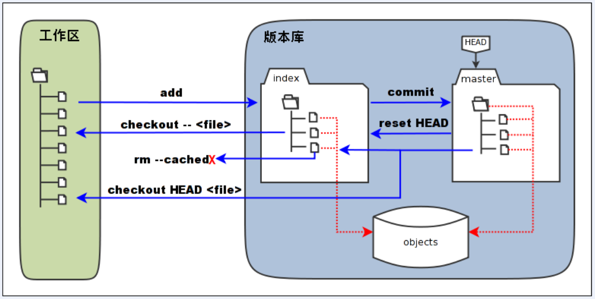

流程：
> **工作区** ---> **暂存区** ---> **版本库** ---> **远程仓库**  
> Git中文件的三种状态：已修改（还未add到Index）---> 已暂存（所有的修改还未提交）---> 已提交（存在版本库中）  
> HEAD：是当前分支版本最顶端的别名，即在当前分支的最后一次提交，相当变量  
> Index：暂存区是一系列将被提交到本地仓库文件集合。它也是将成为HEAD的那个commit对象 


#### 初始化Git环境
```
生成SSH密钥对:
ssh-keygen -t rsa -C "youremail@example.com"

初始化当前目录以生成版本库：
    git init . 
    
创建Git服务端形式的无工作区裸仓库：  
    git init --bare workspace.git
    
git config 环境设置:
    --global：   用户全局，配置位于  ~/.gitconfig
    --system：   系统全局，配置位于 /etc/gitconfig
    --local：    针对当前项目，配置位于 .git/conf
    
跳过命令设置的方式对特定作用范围的配置文件直接进行编辑：   
    git config -e  [--global|--system|--local]

设置用户信息：
    git config  --global user.name  "bluevitality"
    git config  --global user.email "inmoonlight@163.com"
    
设置默认的编辑器：  
    git config --system core.editor vim
    
设置默认的差异分析工具：  
    git config --system merge.tool vimdiff
    
使用别名代替常用命令：  
    git config --global alias.st status
    
查看所有的Git配置信息：  
    git config --list
```
#### 本地 Git 操作 ...
```
克隆远程仓库到本地：
    git clone git@github.com/bluevitality/Bluevitality.git  ./Bluevitality  

隐藏当前现场处理其他任务，即保存当前工作区与暂存区的状态：
    git stash
    
查看隐藏的现场列表：  
    git stash --list
    
恢复or删除现场：  
    git stash [apply|drop]
    
回到隐藏现场的分支后弹出保存的现场并继续处理：  
    git stash pop
  
将工作区改变的对象添加到暂存区：
    git add filename
    git add .
    git add *
    git add -A / --all                <--- 包括删除对象的操作，默认仅添加修改或新增的对象
    
对文件改名：
    git mv Oldname Newname 
    
删除文件：（若要删除已修改并提交到暂存区的文件则需要再添加 "-f" 参数）  
    git rm filename
    
将指定文件从暂存区删除，即 "untage"，用于停止对特定文件追踪：  
    git rm --cached filename
    
恢复误删的文件：
    git checkout -- filename
    注：若修改后未执行add则将指定文件返回至版本库的最新状态
    若已添加至暂存区后又进行了则将其回退至add时最初的暂存区保存的状态
    即让文件回退至最近的一次 commit 或 add 后的状态...
    
用HEAD所指向的分支的全部或部分文件来替换暂存区和工作区：  
    git checkout HEAD [.|filename]
    
将 "git add" 命令与 "git commit" 合为一条命令提交到本地的仓库：    
    git commit -a -m "commit info.."
   
将当前本暂存区要提交的信息与上一次提交合为1个提交（若暂存区未发生改变则相当于重写上次的提交信息）     
    git commit --amend -m "提交合并"

在本地创建分支时指定和远程分支的对应关系：  
    git checkout -b other origin/other
    
设置本地分支与远程分支的对应关系：  
    git branch --set-upstram othser osrigin/other`
 
查看本地及远程仓库的分支信息：  
    git branch -av
    注：参数-v附加显示各分支的最后一次提交信息，若仅查看远程仓库信息则使用-r

删除分支：( 未进行合并时需要使用强制删除参数:'branch -D' )
    git branch -d Name

在本地创建一个分支后推送到远程仓库：  
    git checkout -b BName
    git push BName origin:BName
    
删除远程仓库分支： 
    git push origin :Bname
    注：原理是是推送空分支到远程即为删除操作，但严格讲不应这样执行

查看哪些分支已经并入了当前的分支中： ( 若不需要保留可用 "git branch -d Name" 进行删除 )    
    git branch --merged
    
查看尚未进行合并的分支：     
    git branch --no-merged
    
查看暂存区与工作区间的状态：     
    git status     
   
查看提交历史：
    git log  --pretty=oneline --pretty=format:"%h %ad :%s" --graph
    注：-#   <--- 用数字作参数则仅显示最近的几次提交信息
    
查看最近三次的提交记录：   
    git log --prrety=oneline -3

用版本库中的文件替换暂存区中的文件：   
    git reset HEAD -- filename

撤销暂存区中的修改，回退到工作区：     
    git reset HEAD filename
    
版本库，暂存区，工作区全部一致，撤回到某个提交点：   
    git reset --hard 578IF734F
    
清空添加到暂存区的内容：   
    git reset .  或：  git reset HEAD
    
撤出暂存区中指定的文件：
    git reset filename  或： git reset HEAD filename
    注：相当于git add的反操作...
    
回退到最新的提交版本：   
    git reset --hard HEAD  

回退到之前的第二个版本：     
    git reset --hard HEAD^  

回退到之前的第100个版本：   
    git reset --hard HEAD~100

回退到指定的提交：   
    git reset --hard 578IF734F

撤销刚才的提交：   
    git reset --soft HEAD^
    注：使用 --soft 时，index和working directory中的内容不作任何改变，仅仅把HEAD指向 <commit>。
    这个模式的效果是，执行后，自<commit>以来的所有改变都会显示在git status的"Changes to be committed"中。 

模拟amend提交（覆盖上一次的提交）：   
    git reset --soft HEAD^ ; git -a -m "amend...." 

查看尚未暂存的文件的改变：（本地与暂存区之间的差异）
    git diff

查看已暂存的文件与上次提交的差异：（暂存区与仓库之间的差异）
    git diff --cached

查看本地版本库最后一次提交与工作目录间的差异：（本地工作区与仓库之间的差异）
    git diff HEAD

查看版本库中最新的文件与工作区的文件的区别：（HEAD指针永远指向当前分支的最后一次提交）     
    git diff HEAD -- filename

查看哪些文件/目录将被删除：   
    git clean -nd

清除工作区中未加入版本库的文件/目录：   
    git clean -fd
```
#### 远程仓库相关操作
```txt
添加远程仓库并将其设置为别名"origin"：
    git remote add origin git@github.com/Bluevitality/Bluevitality.git

删除远程仓库：
    git remote rm <Bluevitality>

查看远程仓库"origin"的信息：    
    git remote show origin

将本地的master分支提交到origin远程仓库：
    git push origin master
    
将本地other分支的内容推送到远程仓库origin的master分支：
    git push origin other:master

建立本地分支和远程分支的关联：  
    git branch --set-upstream <本地分支名>  origin/<远程分支名>

修改远程仓库名称：  
    git remote rename <OLDname> <NEWname>

从远程仓库拉取本地仓库还没有的数据：  
    git fetch origin
    注：fetch操作仅拉取远端数据到本地而不合并，需手工进行合并
    
将从远程仓库（fetch下来的数据）与当前分支进行合并操作：
    git merge origin/master

从远程仓库拉取本地仓库还没有的数据并且进行合并操作！  
    git pull origin master
    
新建并切换到一个分支：
    git checkout -b Name
    注：相当于两条命令：git branch Name && git checkout Name
    
合并特定分支到当前分支：
    git merge --no-ff Name
    注：建议增加 --no-ff 参数，使得执行快速合并时历史记录中仍保留此分支的信息
    
克隆某个分支  
    git clone -b b1 https://github.com/...

克隆所有分支  
    git clone https://github.com/...  
    git branch -r  
    * master
    origin/HEAD -> origin/master
    origin/master  
    origin/b1
    git checkout b1

将本地的状态回退到和远程的一样：
    git reset –hard origin/master
```
#### Tag
```txt
针对提交历史中特定提交打标签 ( 删除特定标签： git tag -d v2.0 )
    git tag v2.0 6723TUYG
    
切换到指定tag：  
    git checkout <Tagname>

默认情况下创建的标签仅存在于本地仓库，若需要推送到远程需设置：     
    git push origin TagName
 
    或一次性推送所有标签：
        git push origin --tags
     
若标签已推到远程后要删除远程标签则麻烦一点：
    首先先从本地删除：   git tag -d v1.0
    再从远程删除：     git push origin :refs/tags/v1.0
  
针对当前分支的最新的commit创建一个标签：     
    git tag v1.0

查看标签信息：     
    git tag
    注：仅查看v1系列的标签：git tag -l "v1."
    
查看标签的指定的commit的提交信息：     
    git show v2.0 
    
对标签详细设置其名字及说明以便区分：     
    git tag -a v3.0 -m "tag info..." 3a1f237 
```
#### 附

