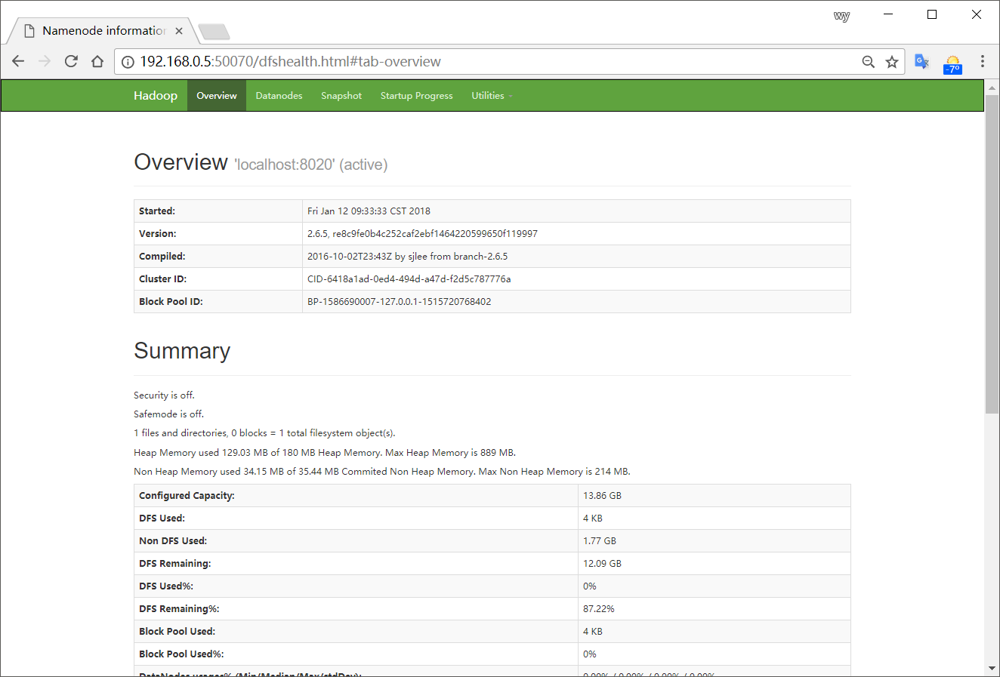
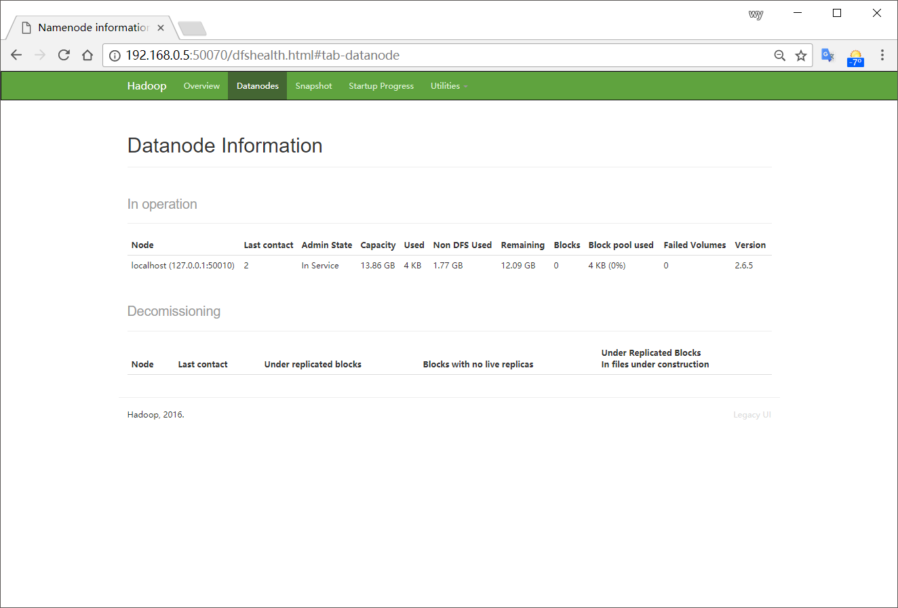
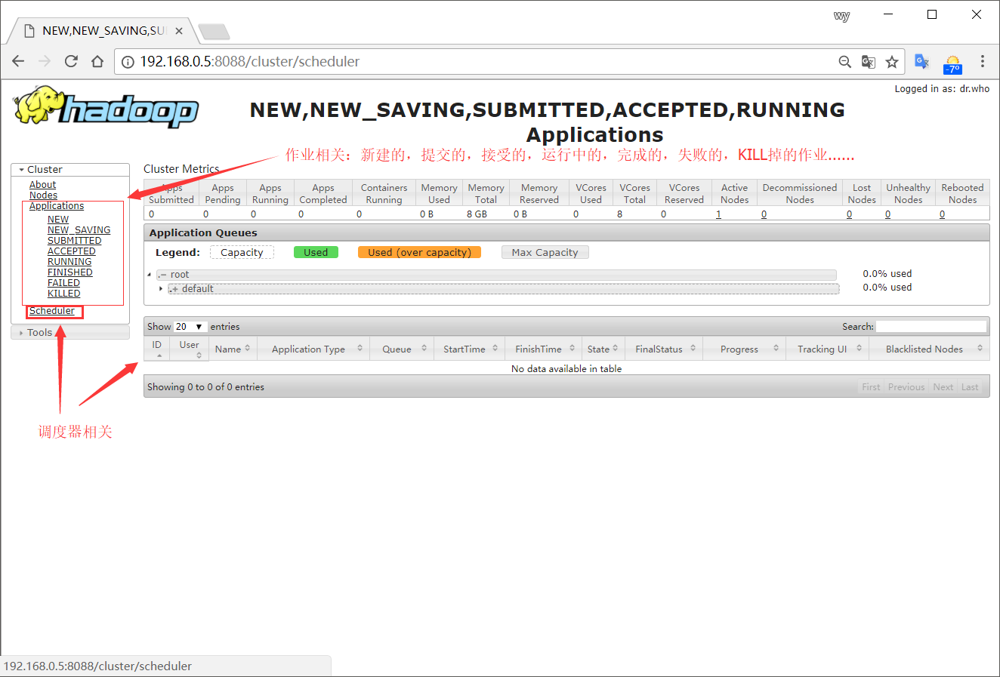
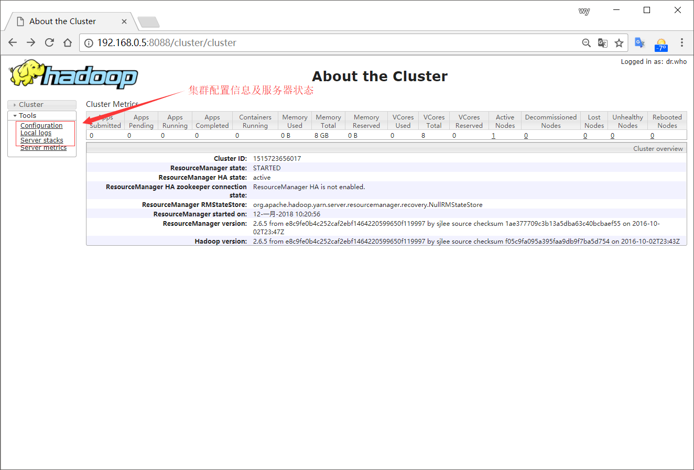
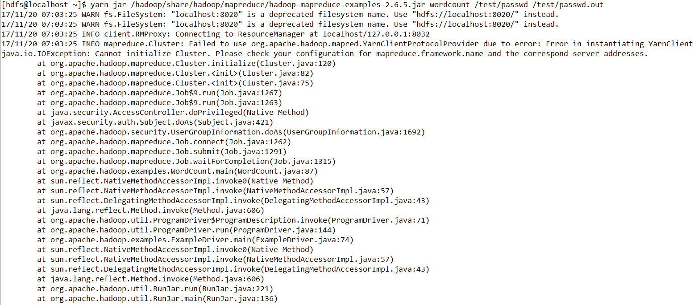

```bash
#hadoop 不同的版本对JDK版本有不同的需求，此处使用：hadoop 2.6.2 JDK 1.7

[root@localhost ~]# yum -y install java-1.7.0-openjdk.x86_64 java-1.7.0-openjdk-devel.x86_64
[root@localhost ~]# echo "export JAVA_HOME=/usr/lib/jvm/java-1.7.0-openjdk-1.7.0.161-2.6.12.0.el7_4.x86_64" \
>> /etc/profile.d/java.sh
[root@localhost ~]# . /etc/profile.d/java.sh
[root@localhost ~]# tar -zxf hadoop-2.6.5.tar.gz -C /
[root@localhost ~]# chown -R root.root /hadoop-2.6.5/
[root@localhost ~]# ln -sv /hadoop-2.6.5/ /hadoop
"/hadoop" -> "/hadoop-2.6.5/"

# etc/hadoop/hadoop-env.sh                  #定制Hadoop守护进程的站点特有环境变量，另外可选用的脚本还有：
# etc/hadoop/mapred-env.sh 和 etc/hadoop/yarn-env.sh 两个：
#     这2个通常用于配置各守护进程JVM配置参数的环境变量有如下几个：
#     HADOOP_NAMENODE_OPTS                  #配置NameNode
#     HADOOP_DATANODE_OPTS                  #配置DataNode
#     HADOOP_SECONDARYNAMENODE_OPTS         #配置Secondary NameNode
#     YARN_RESOURCEMANAGER_OPTS             #配置ResourceManager
#     YARN_NODEMANAGER_OPTS                 #配置NodeManager
#     YARN_PROXYSERVER_OPTS                 #配置WebAppProxy
#     HADOOP_JOB_HISTORYSERVER_OPTS         #配置Map Reduce Job History Server
#     HADOOP_PID_DIR                        #守护进程PID的存储目录
#     HADOOP_LOG_DIR                        #守护进程日志文件的存储目录
#     HADOOP_HEAPSIZE /YARN_HEAPSIZE        #对内存可使用的内存空间上线，默认为1000
#     
#     例如：如果需哟为NameNode使用paralleiGC,可在hadoop-env.sh文件中使用如下语句：
#     export HADOOP_NAMENODE_OPTS="-xx:+UseParallelGC"

# Hadoop大多数守护进程默认使用的堆大小为1GB，在生产环境中可能需要对其各类进程的堆大小做出调整

[root@localhost ~]# cat /etc/profile.d/hadoop.sh
export HADOOP_PREFIX="/hadoop"                                  #安装路径
export PATH=$PATH:$HADOOP_PREFIX/bin:$HADOOP_PREFIX/sbin        #可执行文件路径
export HADOOP_COMMON_HOME=${HADOOP_PREFIX}                      #common组件的家目录（hdfs和yarn都用到的公共组件）
export HADOOP_HDFS_HOME=${HADOOP_PREFIX}                        #...
export HADOOP_MAPRED_HOME=${HADOOP_PREFIX}                      #...
export HADOOP_YARN_HOME=${HADOOP_PREFIX}                        #...
[root@localhost ~]# . /etc/profile

#出于安全目的，通常要以hadoop为组，分别为三个用户 yarn，hdfs，mapred 来运行相应的进程...
[root@localhost ~]# groupadd hadoop
[root@localhost ~]# useradd -g hadoop yarn
[root@localhost ~]# useradd -g hadoop hdfs
[root@localhost ~]# useradd -g hadoop mapred

#Hadoop需要不同权限的数据和日志目录，这里以/data/hadoop/hdfs 作为 HDFS 的数据存储目录
[root@localhost ~]# mkdir -pv /data/hadoop/hdfs/{nn,snn,dn}
[root@localhost ~]# chown -R hdfs.hadoop /data/hadoop/hdfs/

[root@localhost ~]# mkdir -p /var/log/hadoop/yarn
[root@localhost ~]# chown yarn.hadoop /var/log/hadoop/yarn/

#而后，在hadoop的安装目录中创建Logs目录，并修改hadoop所有文件的属主/属组
[root@localhost ~]# mkdir /hadoop/logs
[root@localhost ~]# chmod -R g+w /hadoop/logs          #使hadoop组中的所有用户都有写权限
[root@localhost ~]# chown -R yarn.hadoop /hadoop       #软连接
[root@localhost ~]# chown -R yarn.hadoop /hadoop/      #实际路径

[root@localhost ~]# cd /hadoop
[root@localhost hadoop]# vim etc/hadoop/core-site.xml            #Hadoop的主站，即核心全局配置
#此文件包含了NameNode主机地址（HDFS元数据主机）及其监听RPC端口等信息，对于伪分布式模型的安装来说其主机地址为 Localhost
#NameNode默认使用的RPC端口为8020
<configuration>
    <!--指定NameNode的地址，即HDFS的服务端口-->
    <property>
        <name>fs.defaultFS</name>                #关键字
        <value>hdfs://localhost:8020/</value>    #值
        <final>true</final>
    </property>
    
    <!--用来设置检查点备份日志的最长时间-->
    <property>
        <name>fs.checkpoint.period</name> 
        <value>3600</value>
    </property>
 </configuration>

[root@localhost hadoop]# vim etc/hadoop/hdfs-site.xml   #
#主要用于配置HDFS相关的属性，如：复制因子（即数据块副本数），NN和DN用于存储数据的目录等...
#数据块副本数对于伪分布式的Hadoop应设为1，而NN和DN用于存储的数据的目录为前面的步骤中专门为其创建的路径
#另外，前面的步骤中也为SNN创建了相关的目录，这里也一并设置其为启用状态
<configuration>
    <!--指定hdfs保存数据的副本数量-->
    <property>
        <name>dfs.replication</name>
        <value>1</value>
    </property>
    <!--指定hdfs中namenode的存储位置-->
    <property>
        <name>dfs.namenode.name.dir</name> 
        <value>file:///data/hadoop/hdfs/nn</value>
    </property>
    <!--指定hdfs中datanode的存储位置-->
    <property>
        <name>dfs.datanode.data.dir</name>
        <value>file:///data/hadoop/hdfs/dn</value>
    </property>
    <!--设置hdfs中checkpoint即SNN的追加日志文件路径-->
    <property>
        <name>fs.checkpoint.dir</name>
        <value>file:///data/hadoop/hdfs/snn</value>
    </property>
    <!--设置hdfs中checkpoint即的编辑目录-->
    <property>
        <name>fs.checkpoint.edits.dir</name>
        <value>file:///data/hadoop/hdfs/snn</value>
    </property>
    <!--若需要其他用户对HDFS有写入权限，还需要再添加如下属性的定义-->
    <property>
        <name>dfs.permissions</name>
        <value>false</value>
    </property>
</configuration>

[root@localhost hadoop]# cp etc/hadoop/mapred-site.xml.template etc/hadoop/mapred-site.xml
[root@localhost hadoop]# vim etc/hadoop/mapred-site.xml
#用于配置集群的MapReduce framework，此处应该指定使用yarn，另外的可用值还有：local/classic
#mapred-site.xml默认不存在，但有模块文件mapred-site.xml.template，只需要将其复制为mapred-site.xml即可
<configuration>
    <!--告诉hadoop的MR(Map/Reduce)运行在YARN上(version 2.0+)，而不是自己直接运行-->
    <property>
          <name>mapreduce.framework.name</name>
          <value>yarn</value>
    </property>
</configuration>

[root@localhost hadoop]# vim etc/hadoop/yarn-site.xml
#用于配置YARN进程及其相关属性，首先需要指定ResourceManager守护进程的主机和监听的端口
#对于伪分布式模型来讲，其主机为localhost，默认的端口为8032，
#其次需要指定ResourceManager使用的scheduler（作业任务的调度器）以及NodeManager的辅助服务
<configuration>
    <!--ResourceManager守护进程的主机和监听的端口-->
    <property>    
        <name>yarn.resourcemanager.address</name> 
        <value>localhost:8032</value>
    </property>
    <!--指定ResourceManager使用的scheduler-->
    <property>    
        <name>yarn.resourcemanager.scheduler.address</name> 
        <value>localhost:8030</value>
    </property>
    <!--资源追踪器的地址-->
    <property>    
        <name>yarn.resourcemanager.resource-tracker.address</name> 
        <value>localhost:8031</value>
    </property>
    <!--YARN的管理地址-->
    <property>    
        <name>yarn.resourcemanager.admin.address</name> 
        <value>localhost:8033</value>
    </property>
    <!--YARN的内置WEB管理地址提供服务的地址及端口-->
    <property>    
        <name>yarn.resourcemanager.webapp.address</name> 
        <value>0.0.0.0:8088</value>
    </property>
    <!--nomenodeManager获取数据的方式是shuffle(辅助服务)-->
    <property>
        <name>yarn.nodemanager.aux-services</name>
        <value>mapreduce_shuffle</value>
    </property>
    <!--使用的shuffleHandler类-->
    <property>
        <name>yarn.nodemanager.aux-services.mapreduce_shuffle.class</name>
        <value>org.apache.hadoop.mapred.ShuffleHandler</value>
    </property>
    <!--使用的调度器的类-->
    <property>
        <name>yarn.resourcemanager.scheduler.class</name> 
        <value>org.apache.hadoop.yarn.server.resourcemanager.scheduler.capacity.CapacityScheduler</value>
    </property>
<configuration>

[root@localhost hadoop]# vim etc/hadoop/slaves  
#存储了当前集群所有slave节点的列表，对于伪分布式来说其内容仅为一个localhost

#确保配置正确dfs.namenode.name.dir属性并设置好其对应的权限后，以hdfs用户的身份执行如下操作：
[root@localhost hadoop]# su - hdfs
[hdfs@localhost ~]$ hdfs namenode -format                 #HDFS格式化
............(略)
18/01/11 01:04:28 INFO namenode.NNConf: XAttrs enabled? true
18/01/11 01:04:28 INFO namenode.NNConf: Maximum size of an xattr: 16384
18/01/11 01:04:29 INFO namenode.FSImage: Allocated new BlockPoolId: BP-220740953-127.0.0.1-1515603868800
18/01/11 01:04:29 INFO common.Storage: Storage directory /data/hadoop/hdfs/nn has been successfully formatted.  
#出现上面的一行提示说明格式化成功
18/01/11 01:04:29 INFO namenode.NNStorageRetentionManager: Going to retain 1 images with txid >= 0
18/01/11 01:04:29 INFO util.ExitUtil: Exiting with status 0
18/01/11 01:04:29 INFO namenode.NameNode: SHUTDOWN_MSG: 
/************************************************************
SHUTDOWN_MSG: Shutting down NameNode at localhost/127.0.0.1
************************************************************/

[hdfs@localhost ~]$ ll /data/hadoop/hdfs/nn
总用量 4
drwxr-xr-x. 2 hdfs hadoop 4096 1月  11 01:04 current
[hdfs@localhost ~]$ ll /data/hadoop/hdfs/nn/current/
总用量 16
-rw-r--r--. 1 hdfs hadoop 351 1月  11 01:04 fsimage_0000000000000000000      #此处即HDFS中NN的映像文件（
-rw-r--r--. 1 hdfs hadoop  62 1月  11 01:04 fsimage_0000000000000000000.md5  #即将内存中的元数据周期性写入持久存储）
-rw-r--r--. 1 hdfs hadoop   2 1月  11 01:04 seen_txid                        #
-rw-r--r--. 1 hdfs hadoop 201 1月  11 01:04 VERSION                          #版本
```
#### HDFS 参数
```txt
[root@localhost ~]# hdfs --help               
Usage: hdfs [--config confdir] COMMAND
       where COMMAND is one of:
  dfs                  run a filesystem command on the file systems supported in Hadoop.
  namenode -format     format the DFS filesystem
  secondarynamenode    run the DFS secondary namenode
  namenode             run the DFS namenode
  journalnode          run the DFS journalnode
  zkfc                 run the ZK Failover Controller daemon
  datanode             run a DFS datanode
  dfsadmin             run a DFS admin client
  haadmin              run a DFS HA admin client
  fsck                 run a DFS filesystem checking utility
  balancer             run a cluster balancing utility
  jmxget               get JMX exported values from NameNode or DataNode.
  mover                run a utility to move block replicas across
                       storage types
  oiv                  apply the offline fsimage viewer to an fsimage
  oiv_legacy           apply the offline fsimage viewer to an legacy fsimage
  oev                  apply the offline edits viewer to an edits file
  fetchdt              fetch a delegation token from the NameNode
  getconf              get config values from configuration
  groups               get the groups which users belong to
  snapshotDiff         diff two snapshots of a directory or diff the
                       current directory contents with a snapshot
  lsSnapshottableDir   list all snapshottable dirs owned by the current user
                                                Use -help to see options
  portmap              run a portmap service
  nfs3                 run an NFS version 3 gateway
  cacheadmin           configure the HDFS cache
  crypto               configure HDFS encryption zones
  storagepolicies      get all the existing block storage policies
  version              print the version

Most commands print help when invoked w/o parameters.
```
```bash
# Hadoop2的启动等操作可通过其位于sbin下的专用脚本进行：
# NameNode：           hadoop-daemon.sh  (start|stop) namenode
# DataNode：           hadoop-daemon.sh  (start|stop) datanode
# Secondary NameNode： hadoop-daemon.sh  (start|stop) secondarynamenode
# ResourceManager：    yarn-daemon.sh  (start|stop)  resourcemanager
# NodeManager：        yarn-daemon.sh  (start|stop)  nodemanager

[root@localhost hadoop]# su - hdfs -c "hadoop-daemon.sh start namenode"                     #启动NN
starting namenode, logging to /hadoop/logs/hadoop-hdfs-namenode-localhost.localdomain.out   #日志位置，其真实后缀为.log
[root@localhost hadoop]# su - hdfs -c "hadoop-daemon.sh start secondarynamenode"            #启动SNN
starting secondarynamenode, logging to /hadoop/logs/hadoop-hdfs-secondarynamenode-localhost.localdomain.out
[root@localhost hadoop]# su - hdfs -c "hadoop-daemon.sh start datanode"                     #启动DN
starting datanode, logging to /hadoop/logs/hadoop-hdfs-datanode-localhost.localdomain.out

[root@localhost hadoop]# hdfs dfs -mkdir /test      #测试HDFS的命令
18/01/11 01:29:30 WARN fs.FileSystem: "localhost:8020" is a deprecated filesystem name. \
Use "hdfs://localhost:8020/" instead.               #告警可以忽略，提示为需修改其配置格式为hdfs开头...

[root@localhost hadoop]# hdfs dfs -ls /             #查看HDFS的/下是否存在test目录
Found 1 items
drwxr-xr-x   - root supergroup          0 2018-01-11 01:29 /test

[root@localhost hadoop]# hdfs dfs -put /etc/fstab /test/   

#注，在宿主机中使用Ls看到的HDFS数据目录是乱码文件，必须要使用HDFS的dfs子命令（接口）进行查看及操作
[root@localhost hadoop]# hdfs dfs -ls /test       
Found 1 items
-rw-r--r--   1 root supergroup        465 2018-01-11 01:32 /test/fstab

#启动YARN的resourcemanager(其在分布式场景中运行在主节点中)
[root@localhost hadoop]# su - yarn -c "yarn-daemon.sh start resourcemanager"        
starting resourcemanager, logging to /hadoop/logs/yarn-hdfs-resourcemanager-localhost.localdomain.out
[root@localhost hadoop]# su - yarn -c "yarn-daemon.sh start nodemanager"  

#注：
# HDFS和YARN ResourceManager 各自提供了一个WEB接口，通过这些接口可检查HDFS集群以及YARN集群的相关状态：
# HDFS-NameNode:          http://<NameNode_Host>:50070/
# YARN-ResourceManager:   http://<ResourceManager_host>:8088/
                          #地址对应yarn-site.xml中的yarn.resourcemanager.webapp.address的值
```






#### MapReduce 测试
```bash
#使用官方自带的MapReduce测试程序运行测试
[root@localhost ~]# cd /hadoop/share/hadoop/mapreduce/      #此目录保存了许多样例程序，可用作Mapreduce的程序测试
[root@localhost mapreduce]# ll
总用量 4876
-rw-rw-r--. 1 yarn hadoop  526732 10月  3 2016 hadoop-mapreduce-client-app-2.6.5.jar
-rw-rw-r--. 1 yarn hadoop  686773 10月  3 2016 hadoop-mapreduce-client-common-2.6.5.jar
-rw-rw-r--. 1 yarn hadoop 1535776 10月  3 2016 hadoop-mapreduce-client-core-2.6.5.jar
-rw-rw-r--. 1 yarn hadoop  259326 10月  3 2016 hadoop-mapreduce-client-hs-2.6.5.jar
-rw-rw-r--. 1 yarn hadoop   27489 10月  3 2016 hadoop-mapreduce-client-hs-plugins-2.6.5.jar
-rw-rw-r--. 1 yarn hadoop   61309 10月  3 2016 hadoop-mapreduce-client-jobclient-2.6.5.jar
-rw-rw-r--. 1 yarn hadoop 1514166 10月  3 2016 hadoop-mapreduce-client-jobclient-2.6.5-tests.jar
-rw-rw-r--. 1 yarn hadoop   67762 10月  3 2016 hadoop-mapreduce-client-shuffle-2.6.5.jar
-rw-rw-r--. 1 yarn hadoop  292710 10月  3 2016 hadoop-mapreduce-examples-2.6.5.jar       #测试程序的Jar包
drwxrwxr-x. 2 yarn hadoop    4096 10月  3 2016 lib
drwxrwxr-x. 2 yarn hadoop      29 10月  3 2016 lib-examples
drwxrwxr-x. 2 yarn hadoop    4096 10月  3 2016 sources

#使用hdfs用户执行，因为测试程序需要向HDFS中写入数据
[root@localhost mapreduce]# su - hdfs
[hdfs@localhost ~]$ yarn jar /hadoop/share/hadoop/mapreduce/hadoop-mapreduce-examples-2.6.5.jar
An example program must be given as the first argument.                        #提示：jar包中有许多测试程序
Valid program names are:                                                       #
  aggregatewordcount: An Aggregate based map/reduce program that counts the wo #从给定的文件中统计单词数
  aggregatewordhist: An Aggregate based map/reduce program that computes the h #
  bbp: A map/reduce program that uses Bailey-Borwein-Plouffe to compute exact  #
  dbcount: An example job that count the pageview counts from a database.      #
  distbbp: A map/reduce program that uses a BBP-type formula to compute exact  #
  grep: A map/reduce program that counts the matches of a regex in the input.  #
  join: A job that effects a join over sorted, equally partitioned datasets    #
  multifilewc: A job that counts words from several files.                     #
  pentomino: A map/reduce tile laying program to find solutions to pentomino p #
  pi: A map/reduce program that estimates Pi using a quasi-Monte Carlo method. #评估PI的值
  randomtextwriter: A map/reduce program that writes 10GB of random textual da #
  randomwriter: A map/reduce program that writes 10GB of random data per node. #
  secondarysort: An example defining a secondary sort to the reduce.           #
  sort: A map/reduce program that sorts the data written by the random writer. #
  sudoku: A sudoku solver.                                                     #
  teragen: Generate data for the terasort                                      #
  terasort: Run the terasort                                                   #
  teravalidate: Checking results of terasort                                   #
  #下面的wordcount是基于MapReduce的方式从指定的文件中统计单词数.....
  wordcount: A map/reduce program that counts the words in the input files.    
  wordmean: A map/reduce program that counts the average length of the words i #
  wordmedian: A map/reduce program that counts the median length of the words  #
  wordstandarddeviation: A map/reduce program that counts the standard deviati #

#使用此jar的wordcount程序进行测试
[hdfs@localhost ~]$ yarn jar /hadoop/share/hadoop/mapreduce/hadoop-mapreduce-examples-2.6.5.jar wordcount  
Usage: wordcount <in> [<in>...] <out>   #从哪个指定的文件进行统计，并将结果输出保存在什么目录

#开始测试 ------------------------------------------------------------------------------------------------

#先存入数据：
[hdfs@localhost ~]$ hdfs dfs -mkdir /test                     #在HDFS的根路径创建test目录
[hdfs@localhost ~]$ hdfs dfs -put /etc/passwd /test           #将本机的passwd文件存入test

#进行测试：
[hdfs@localhost ~]$ yarn jar /hadoop/share/hadoop/mapreduce/hadoop-mapreduce-examples-2.6.5.jar \
wordcount /test/passwd /test/passwd.out

#查看统计信息：
[hdfs@localhost ~]$ hdfs dfs -cat /test/passwd.out/part-r-000000
17/11/20 07:42:08 INFO client.RMProxy: Connecting to ResourceManager at localhost/127.0.0.1:8032
17/11/20 07:42:09 INFO input.FileInputFormat: Total input paths to process : 1
17/11/20 07:42:09 INFO mapreduce.JobSubmitter: number of splits:1
17/11/20 07:42:09 INFO mapreduce.JobSubmitter: Submitting tokens for job: job_1511134917246_0001
17/11/20 07:42:10 INFO impl.YarnClientImpl: Submitted application application_1511134917246_0001
17/11/20 07:42:10 INFO mapreduce.Job: The url to track the job: http://localhost:8088/proxy/applic\
ation_1511134917246_0001/
17/11/20 07:42:10 INFO mapreduce.Job: Running job: job_1511134917246_0001
17/11/20 07:42:17 INFO mapreduce.Job: Job job_1511134917246_0001 running in uber mode : false
17/11/20 07:42:17 INFO mapreduce.Job:  map 0% reduce 0%
17/11/20 07:42:22 INFO mapreduce.Job:  map 100% reduce 0%
17/11/20 07:42:27 INFO mapreduce.Job:  map 100% reduce 100%
17/11/20 07:42:27 INFO mapreduce.Job: Job job_1511134917246_0001 completed successfully
17/11/20 07:42:27 INFO mapreduce.Job: Counters: 49
        File System Counters
                FILE: Number of bytes read=1433
                FILE: Number of bytes written=217725
                FILE: Number of read operations=0
                FILE: Number of large read operations=0
                FILE: Number of write operations=0
                HDFS: Number of bytes read=1259
                HDFS: Number of bytes written=1247
                HDFS: Number of read operations=6
                HDFS: Number of large read operations=0
                HDFS: Number of write operations=2
        Job Counters 
                Launched map tasks=1
                Launched reduce tasks=1
                Data-local map tasks=1
                Total time spent by all maps in occupied slots (ms)=3057
                Total time spent by all reduces in occupied slots (ms)=2771
                Total time spent by all map tasks (ms)=3057
                Total time spent by all reduce tasks (ms)=2771
                Total vcore-milliseconds taken by all map tasks=3057
                Total vcore-milliseconds taken by all reduce tasks=2771
                Total megabyte-milliseconds taken by all map tasks=3130368
                Total megabyte-milliseconds taken by all reduce tasks=2837504
        Map-Reduce Framework
                Map input records=24
                Map output records=46
                Map output bytes=1345
                Map output materialized bytes=1433
                Input split bytes=98
                Combine input records=46
                Combine output records=45
                Reduce input groups=45
                Reduce shuffle bytes=1433
                Reduce input records=45
                Reduce output records=45
                Spilled Records=90
                Shuffled Maps =1
                Failed Shuffles=0
                Merged Map outputs=1
                GC time elapsed (ms)=63
                CPU time spent (ms)=1690
                Physical memory (bytes) snapshot=442707968
                Virtual memory (bytes) snapshot=2118053888
                Total committed heap usage (bytes)=277348352
        Shuffle Errors
                BAD_ID=0
                CONNECTION=0
                IO_ERROR=0
                WRONG_LENGTH=0
                WRONG_MAP=0
                WRONG_REDUCE=0
        File Input Format Counters 
                Bytes Read=1161
        File Output Format Counters 
                Bytes Written=1247
```
##### 首次部署后使用官方自带的MapReduce测试jar单词统计失败 ( 修改core-site.xml文件后成功... )
##### 以下是成功执行yarn上的MapReduce测试程序 "wordcount" 后的单词统计输出信息
```bash
[hdfs@localhost ~]$ hdfs dfs -cat /test/passwd.out/part-r-00000
Bus     1
IPv4LL  1
Management:/:/sbin/nologin      1
Network 1
Proxy:/:/sbin/nologin   1
SSH:/var/empty/sshd:/sbin/nologin       1
Stack:/var/lib/avahi-autoipd:/sbin/nologin      1
User:/var/ftp:/sbin/nologin     1
adm:x:3:4:adm:/var/adm:/sbin/nologin    1
avahi-autoipd:x:170:170:Avahi   1
bin:x:1:1:bin:/bin:/sbin/nologin        1
bus:/:/sbin/nologin     1
by      1
daemon:/dev/null:/sbin/nologin  1
daemon:x:2:2:daemon:/sbin:/sbin/nologin 1
dbus:x:81:81:System     1
for     1
ftp:x:14:50:FTP 1
games:x:12:100:games:/usr/games:/sbin/nologin   1
halt:x:7:0:halt:/sbin:/sbin/halt        1
hdfs:x:1001:1000::/home/hdfs:/bin/bash  1
lp:x:4:7:lp:/var/spool/lpd:/sbin/nologin        1
mail:x:8:12:mail:/var/spool/mail:/sbin/nologin  1
mapred:x:1002:1000::/home/mapred:/bin/bash      1
message 1
nobody:x:99:99:Nobody:/:/sbin/nologin   1
operator:x:11:0:operator:/root:/sbin/nologin    1
package 1
polkitd:/:/sbin/nologin 1
polkitd:x:997:995:User  1
postfix:x:89:89::/var/spool/postfix:/sbin/nologin       1
root:x:0:0:root:/root:/bin/bash 1
sandbox 1
shutdown:x:6:0:shutdown:/sbin:/sbin/shutdown    1
sshd:x:74:74:Privilege-separated        1
sync:x:5:0:sync:/sbin:/bin/sync 1
systemd-bus-proxy:x:999:997:systemd     1
systemd-network:x:998:996:systemd       1
tcsd    1
the     2
to      1
trousers        1
tss:x:59:59:Account     1
used    1
yarn:x:1000:1000::/home/yarn:/bin/bash  1
```
##### 以下是失败的例子

