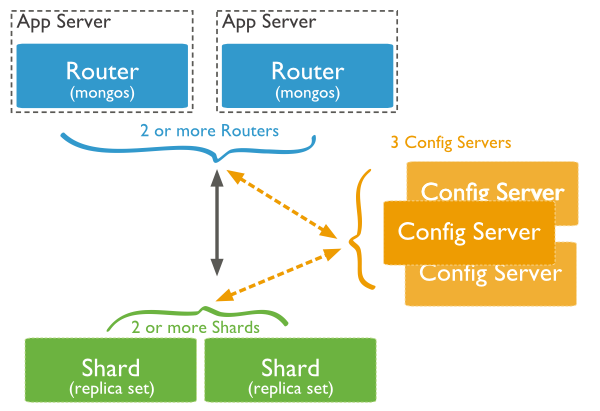

#### 备忘
```txt
当数据量很大时需用到分片：
    将数据分若干部分（称分段或分片）存在不同服务器中，可将大型的集合分割保存到不同服务器上
    与其他的分区方案相比MongoDB几乎能自动为我们完成所有事情。

考虑用 Sharded cluster 时通常是要解决如下2个问题：
    1.存储容量受单机限制，即磁盘资源遭遇瓶颈
    2.读写能力受单机限制（读能力也可以在复制集里加 secondary 来扩展）可能是 CPU、内存或网卡等资源瓶颈导致读写能力无法扩展
    如果你没有遇到上述问题，使用 MongoDB 复制集就足够了，管理维护上比 Sharded cluster 要简单很多
```
#### 下图展示了在 MongoDB 中使用分片集群的结构分布模型

```txt
1.Query Routers:  前端路由，客户端由此接入并且让整个集群像是单一数据库，前端应用可透明使用（客户端无需了解其他节点存在）
2.Config Server:  元数据服务器，存储了整个 Cluster Metadata，其中包括chunk信息...
3.Shard:          存储实际数据块，生产环境中1个Shard角色可由多个节点组个1个replica set承担来防止单点故障!

    insert/request----> [mongos"路由器"] -------> [configsvr] -------> shard1.....shardN
```
#### 部署流程
```txt
Mongodb的分片可依据索引的不同类型进行针对性的设置（不同的索引类型其分片的方式不同）...
在对一个集合进行分片之前必须开启这个集合数据库的分片功能（开启这个功能并不会重新分配数据但能使集合能够分片）
在实际的生产环境中，Mongodb的分片需要进行高可用设计，如2个mongos，3个configserver，以及若干副本集组成的Sharding

先启动若干mongodb服务器（shard1:100012 shard2:100013 shard1:100014）

一，configserver:
    ./mongod --dbpath /data/mongodb/shard/config  --fork --configsvr \
    --logpath log/mongodb.confserver.log --logappend
    #通常只要指定--configsvr选项即可(监听27019端口)，其数据目录用来保存元数据，若使用配置文件则：configsvr=true
    
二，mongos：
    ./mongos --logpath /data/mongodb/mongos/mongos.log  -fork \
    --configdb <IP:port> <IP:port> <IP:port> ...  \
    #--chunkSize 500
    #chunkSize选项用来指定chunk大小，单位MB，默认200MB (建议使用命令方式修改大小)

三，配置Sharding（注意是在mongos节点执行如下的添加块节点命令...）：

    > sh.addShard("<address>:<port>");          #添加Shard节点
    > sh.addShard("<address>:<port>");          #
    > sh.addShard .........                     #
    
    > sh.enablesharding("<database>");          #指明在哪个数据库中启用分片功能
    > sh.shardCollection('demo.x1',{"age":1});	#对demo库的x1集合做分片并且在此集合的age字段创建索引
    
    > sh.isBalancerRunning()                    #查看分片的均衡器是否处于工作状态（默认在需要均衡时将自动启动）
    > sh.setBalancerState([bool])               #启用或关闭均衡功能
    > sh.getBalancerState()                     #查看均衡状态....


# 分片方式：（需要根据业务模型进行选择）
#    1.基于列表分片
#    2.基于HASH分片
#    3.基于范围分片

# 使用mongo shell 插入测试数据:
# for (var i=1; i<=100000; i++) { 
#     db.cc.insert({"id": i,"myName" : "name_"+i, "myDate" : new Date()},"age" : i ); 
# } 


# 手动预先分片：
# for(var i=1;i<20000;i++) { sh.splitAt('库名.表名',{ID类型的列:i*10000})};	#遇到1W倍数时则进行分片（减少了IO）
```
#### 分片相关命令的帮助信息：sh.help()
```txt
> sh.help()
        sh.addShard( host )                       server:port OR setname/server:port
        sh.enableSharding(dbname)                 enables sharding on the database dbname
        sh.shardCollection(fullName,key,unique)   shards the collection
        sh.splitFind(fullName,find)               splits the chunk that find is in at the median
        sh.splitAt(fullName,middle)               splits the chunk that middle is in at middle
        sh.moveChunk(fullName,find,to)            move the chunk where 'find' is to 'to' (name of shard)
        sh.setBalancerState( <bool on or not> )   turns the balancer on or off true=on, false=off
        sh.getBalancerState()                     return true if enabled
        sh.isBalancerRunning()                    return true if the balancer has work in progress on any mongos
        sh.addShardTag(shard,tag)                 adds the tag to the shard
        sh.removeShardTag(shard,tag)              removes the tag from the shard
        sh.addTagRange(fullName,min,max,tag)      tags the specified range of the given collection
        sh.status()                               prints a general overview of the cluster
```
