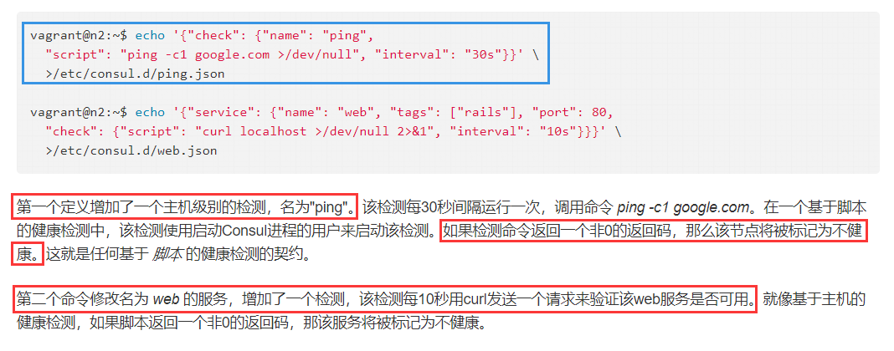

#### 备忘
```txt
Consul是支持多数据中心分布式高可用的服务发现和配置共享的服务软件，由 HashiCorp 公司用 Go 语言开发
基于 Mozilla Public License 2.0 的协议进行开源. 支持健康检查并允许 HTTP 和 DNS 协议调用 API 存储键值对
完成安装后所有节点必须运行agent! agent可分为：server、client...
每个数据中心至少须有1台consul -server ( 会成为集群中的Leader )
集群中其他agent运行为client。它是轻量级进程，主要负责注册服务、健康检查、转发对server的查询...
```
#### 环境
```txt
        node1   --->    服务端
        node2   --->    客户端
        node3   --->    客户端
```
#### Consul 服务端部署
```bash
[root@node1 ~]# unzip consul_0.8.1_linux_amd64.zip           #解压
Archive:  consul_0.8.1_linux_amd64.zip
  inflating: consul                     
[root@node1 ~]# install -m 755 consul /usr/local/bin/consul  #各Node拷贝到指定目录并赋予权限
[root@node2 ~]# install -m 755 consul /usr/local/bin/consul  #
[root@node3 ~]# install -m 755 consul /usr/local/bin/consul  #

[root@node1 ~]# mkdir -p /etc/consul.d/ 
[root@node1 ~]# consul agent -server -rejoin -bootstrap -data-dir /var/consul -node=node1 -ui \
-config-dir=/etc/consul.d/ -bind=192.168.0.5 -client 0.0.0.0

==> WARNING: Bootstrap mode enabled! Do not enable unless necessary
==> Starting Consul agent...
==> Consul agent running!
           Version: 'v0.8.1'
           Node ID: '8166fcee-5187-609d-ef62-159cf6951df9'
         Node name: 'node1'
        Datacenter: 'dc1'
            Server: true (bootstrap: true)
       Client Addr: 0.0.0.0 (HTTP: 8500, HTTPS: -1, DNS: 8600)
      Cluster Addr: 192.168.0.5 (LAN: 8301, WAN: 8302)
    Gossip encrypt: false, RPC-TLS: false, TLS-Incoming: false
             Atlas: <disabled>

==> Log data will now stream in as it occurs:

    2017/12/31 15:09:41 [INFO] raft: Initial configuration (index=1): [{Suffrage:Voter ID:192.168.0.5:8300 Address:192.168.0.5:8300}]
    2017/12/31 15:09:41 [INFO] raft: Node at 192.168.0.5:8300 [Follower] entering Follower state (Leader: "")
    2017/12/31 15:09:41 [INFO] serf: EventMemberJoin: node1 192.168.0.5
    2017/12/31 15:09:41 [INFO] consul: Adding LAN server node1 (Addr: tcp/192.168.0.5:8300) (DC: dc1)
    2017/12/31 15:09:41 [INFO] serf: EventMemberJoin: node1.dc1 192.168.0.5
    2017/12/31 15:09:41 [INFO] consul: Handled member-join event for server "node1.dc1" in area "wan"
    2017/12/31 15:09:48 [ERR] agent: failed to sync remote state: No cluster leader
    2017/12/31 15:09:51 [WARN] raft: Heartbeat timeout from "" reached, starting election
    2017/12/31 15:09:51 [INFO] raft: Node at 192.168.0.5:8300 [Candidate] entering Candidate state in term 2
    2017/12/31 15:09:51 [INFO] raft: Election won. Tally: 1
    2017/12/31 15:09:51 [INFO] raft: Node at 192.168.0.5:8300 [Leader] entering Leader state
    2017/12/31 15:09:51 [INFO] consul: cluster leadership acquired
    2017/12/31 15:09:51 [INFO] consul: New leader elected: node1
    2017/12/31 15:09:51 [INFO] consul: member 'node1' joined, marking health alive
==> Newer Consul version available: 1.0.2 (currently running: 0.8.1)
    2017/12/31 15:09:53 [INFO] agent: Synced service 'consul'

#参数：
#-server	使agent运行在server模式
#-rejoin	忽略先前的离开、再次启动时仍尝试加入集群
#-bootstrap-expect 在1个"datacenter"中期望的server数量，启用则等待达到指定数量时才引导整个集群（不能和bootstrap共用）
#-bootstrap	设置S端是否为"bootstrap"模式。若数据中心仅1个server则需启用。
#-data-dir	为agent存放元数据，任何节点都要有。该目录应在持久存储中（不丢失），若server模式则用于记录整个集群state
#-node          本节点在集群中的名称，在集群中它必须唯一，默认是该节点主机名（建议指定）
#-ui-dir        提供存放web ui资源的路径。该目录必须可读！
#-config-dir    需加载的配置目录，其中".json"格式的文件都会被加载，表示node自身所注册的服务文件的存储路径
#-config-file   需加载的配置文件，文件是"json"格式的信息，该参数可多次配置，后面文件加载的参数会覆盖前面文件中的参数...
#-bind          该地址用于集群内部通讯、C/S均需设置，集群内所有节点到此地址都必须可达，默认：0.0.0.0
#-client	将绑定到client接口的地址（即公开地址），其提供HTTP、DNS、RPC服务。默认"127.0.0.1"。RPC地址会被其他consul命令使用
#-log-level	日志级别。默认"info"。有如下级别："trace","debug", "info", "warn",  "err"。可用：consul monitor来连接节点查看日志
#-syslog        将日志记录进syslog，仅支持Linux和OSX平台
#-pid-file      记录pid号
#-datacenter    数据中心名字，旧版本选项为：-dc
#-ui		启动内建的Web页面

# consul也支持使用json方式保存启动配置信息：
# {  
# 	"datacenter": "east-aws",  	
# 	"data_dir": "/opt/consul",  
# 	"log_level": "INFO",  	
# 	"node_name": "foobar",  
# 	"server": true,  
# 	"watches": [  
# 		{  
# 			"type": "checks",  
# 			"handler": "/usr/bin/health-check-handler.sh" 
# 		}  
# 	],  
# 	"telemetry": {  
# 		"statsite_address": "127.0.0.1:2180"  
# 	}  
# }
```
#### Consul 客户端部署
```bash
[root@node2 ~]# consul agent -ui -data-dir /var/consul -node=node2 -datacenter=dc1 -config-dir=/etc/consul.d/ \
-bind=192.168.0.6  -join 192.168.0.5 
==> Starting Consul agent...
==> Joining cluster...
    Join completed. Synced with 1 initial agents
==> Consul agent running!
           Version: 'v0.8.1'
           Node ID: '8e0284b0-9c86-be65-972a-30a2d9d11b1b'
         Node name: 'node2'
        Datacenter: 'dc1'
            Server: false (bootstrap: false)
       Client Addr: 127.0.0.1 (HTTP: 8500, HTTPS: -1, DNS: 8600)
      Cluster Addr: 192.168.0.6 (LAN: 8301, WAN: 8302)
    Gossip encrypt: false, RPC-TLS: false, TLS-Incoming: false
             Atlas: <disabled>

==> Log data will now stream in as it occurs:

    2017/12/31 15:23:44 [INFO] serf: EventMemberJoin: node2 192.168.0.6
    2017/12/31 15:23:44 [INFO] agent: (LAN) joining: [192.168.0.5]
    2017/12/31 15:23:44 [INFO] serf: EventMemberJoin: node1 192.168.0.5
    2017/12/31 15:23:44 [INFO] agent: (LAN) joined: 1 Err: <nil>
    2017/12/31 15:23:44 [WARN] manager: No servers available
    2017/12/31 15:23:44 [ERR] agent: failed to sync remote state: No known Consul servers
    2017/12/31 15:23:44 [INFO] consul: adding server node1 (Addr: tcp/192.168.0.5:8300) (DC: dc1)
    2017/12/31 15:23:46 [INFO] agent: Synced node info
==> Newer Consul version available: 1.0.2 (currently running: 0.8.1)

#备忘说明：
#参数："-ui" 启动内建界面，可通过："http://1ocalhost:8500/ui/" 的形式访问
#参数："-join" 使agent加入已有集群。当agent以client模式运行时不加参数："-server"即可！
#后期加入集群："consul join <任一集群节点Ip>" 
#注：若报：Error joining the cluster: dial tcp 10.0.0.53:8301: getsockopt: no route to host 可能是防火墙的原因，检查端口8301是否开放
#为加入集群，一个agent仅需了解一个已存在的集群成员，加入集群后agent将会自动传递完整的成员信息......
#重启/移除节点：consul <reload/leave>	 服务定义可通过配置文件并发送SIGHUP信号给agent进行更新
#参数："-client"指定了客户端绑定地址，用于HTTP、DNS、RPC服务
#consul <join/members> 都是通过RPC与Consul交互的，例：-rpc-addr=192.168.11.143:8400
```
#### 查看集群节点成员
```bash
[root@node1 ~]# consul members	     #或：curl -s http://192.168.0.5:8500/v1/agent/members | python -m json.tool
Node   Address           Status  Type    Build  Protocol  DC
node1  192.168.0.5:8301  alive   server  0.8.1  2         dc1
node2  192.168.0.6:8301  alive   client  0.8.1  2         dc1
node3  192.168.0.7:8301  alive   client  0.8.1  2         dc1
```
#### 注册服务以及查询
```bash
#搭建好conusl集群后用户和程序便能到consul中去查询&注册服务。可通过2种方式：
#   1： 服务定义文件
#   2： HTTP API
#本例假设有名叫web2的服务运行在80端口，另为其设一个标签："tags" 以便使用其作为额外的查询信息......
#如需注册多个服务可在配置目录下创建多个服务定义文件。若使用RESTFul API的方式则无需执行consul reload
[root@node2 ~]# echo '{"service": {"name": "web2", "tags": ["rails"], "port": 80}}' > /etc/consul.d/web.json
[root@node2 ~]# consul reload					#重载Client端的Consul配置信息...

#当出现下列输出中的 agent: Synced service XXX 时，说明服务注册成功!...
==> Log data will now stream in as it occurs:
    ........(略)
    2017/12/31 15:43:18 [INFO] serf: Re-joined to previously known node: node3: 192.168.0.7:8301
    2017/12/31 15:43:18 [INFO] consul: adding server node1 (Addr: tcp/192.168.0.5:8300) (DC: dc1)
    2017/12/31 15:43:18 [INFO] agent: (LAN) joined: 1 Err: <nil>
    2017/12/31 15:43:18 [INFO] agent: Synced service 'web2'     #载入了服务定义并成功注册...
==> Newer Consul version available: 1.0.2 (currently running: 0.8.1)

#查询注册的服务所在的IP及端口等信息
[root@node1 ~]# curl -s http://node1:8500/v1/catalog/service/web2 | python -m json.tool
[
    {
        "Address": "192.168.0.6",
        "CreateIndex": 930,
        "ID": "8e0284b0-9c86-be65-972a-30a2d9d11b1b",
        "ModifyIndex": 930,
        "Node": "node2",
        "NodeMeta": {},
        "ServiceAddress": "",
        "ServiceEnableTagOverride": false,
        "ServiceID": "web2",
        "ServiceName": "web2",
        "ServicePort": 82,
        "ServiceTags": [
            "rails1"
        ],
        "TaggedAddresses": {
            "lan": "192.168.0.6",
            "wan": "192.168.0.6"
        }
    }
]
#仅查询状态健康的web2服务：curl http://localhost:8500/v1/health/service/web2?passing

#通过内置的DNS查询服务信息（基于标记的服务查询的格式是 TAG.NAME.service.consul）
[root@node1 ~]# dig +short @127.0.0.1 -p 8600 web2.service.consul  SRV
1 1 82 node2.node.dc1.consul.	#启动的82为服务端口，node2.node.dc1.consul为服务名，可借助查询到的此域名访问

[root@node1 ~]# dig +short @127.0.0.1 -p 8600 web2.service.consul A
192.168.0.6			#服务所在的IP地址
```
#### 健康检查
```bash
#与服务定义相同，检查定义可通过2种方式：1：检查定义、2：HTTP API
#在基于脚本的健康检查中的约定：脚本运行于与Consul进程相同的UID并且其以非0值返回则此节点被标为不健康!
#Check脚本可自由地做任何事情确定check状态。唯一限制是退出代码必须遵循下面的约定：0 -> 正常、 1 -> 告警、其他 -> 失败
#每种check都须包含name，但id、notes可选。若未提供id则其被设为name。
#在一个节点中的每个check的ID必须唯一！因此若check的name值冲突那么ID就应设置......
#字段notes用于增强checks的可读性。Script check中"notes"字段可由脚本生成，脚本其他的输出保存在notes中以供查看
#字段notes同样适用HTTP接口更新TTL check的外部程序一样可设置notes字段......
#注意，当尝试用DNS查询不健康的服务时Consul将不会返回结果，因为服务不健康!.....
	
#Example1：
	{  
	   "check": {  
	      "id": "mem-util",  
	      "name": "Memoryutilization",  
	      "docker_container_id": "f972c95ebf0e",  
	      "shell": "/bin/bash",  "script": "/usr/local/bin/check_mem.py", "interval": "10s"  
	   }  
	}

#Example2:
	{  
		"service":{  
			"id": "jetty",  
			"name": "jetty", "address": "192.168.1.200", "port": 8080, "tags": ["dev"],  
			"checks": [  
				{  
					"http": "http://192.168.1.200:8080/health", "interval": "5s"  
				}  
			]  
	}  }  

[root@node2 ~]# echo '{"check": {"name": "ping", "script": "ping -c1 163.com >/dev/null", "interval": "30s"}}' \
>/etc/consul.d/ping.json

#查询特定健康状态的服务：
[root@node1 ~]# curl -s http://localhost:8500/v1/health/state/passing?dc=dc1 | python -m json.tool
[
    {
        "CheckID": "ping",
        "CreateIndex": 892,
        "ModifyIndex": 915,
        "Name": "ping",
        "Node": "node1",
        "Notes": "",
        "Output": "",
        "ServiceID": "",
        "ServiceName": "",
        "Status": "passing"
    },
    ......(略)
    
# state可以是：			eg：/v1/health/state/<XXXX>?dc=XX
# 	 "any"
# 	 "unknown"
# 	 "passing"
# 	 "warning"
# 	 "critical"
```



