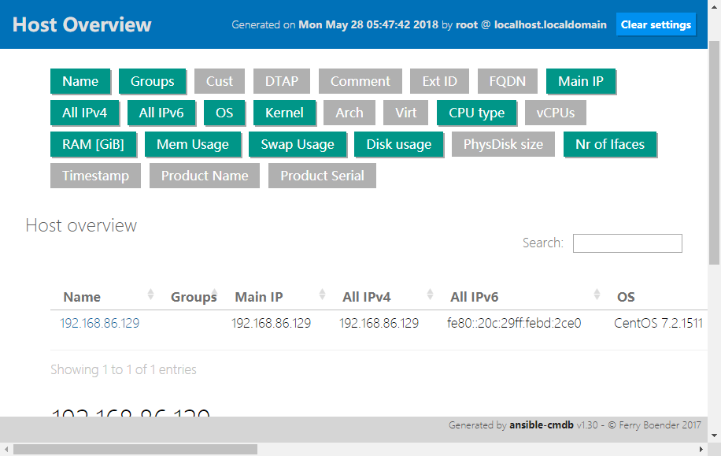

#### Install
```bash
[root@localhost ~]# pip install sqlmap -i http://pypi.douban.com/simple/ --trusted-host pypi.douban.com
[root@localhost ~]# cd /root/ansible-cmdb-1.30
[root@localhost ~]# python setup.py install
```
#### Demo
```bash
[root@localhost ~]# ansible -i x all -m setup --tree /tmp/ansible-cmdb  #使用setup模块收集主机信息后导出到指定目录
[root@localhost ~]# ansible-cmdb /tmp/ansible-cmdb > index.html    #使用ansible-cmdb模块将生成的JSON串转为静态页面

#以资产列表得形式统计出主机信息：
[root@localhost ~]# ansible-cmdb -t txt_table --columns name,os,ip,mem,cpus out
Name            OS               IP              Mem  CPUs  
--------------  ---------------  --------------  ---  ----  
192.168.86.129  CentOS 7.2.1511  192.168.86.129  2g   1   

#输出为sql格式的文件：
[root@localhost ~]# ansible-cmdb -t sql out > cmdb.sql      #将数据导入数据库：  mysql -uroot -p ansdb < cmdb.sql 
```
#### 支持的元信息
```txt
| name 
| fqdn 
| main_ip 
| os_name 
| os_version
| system 
| kernel 
| arch_hardware 
| arch_userspace
| virt_type 
| virt_role 
| cpu_type 
| vcpus 
| ram 
| disk_total 
| disk_free
```
#### WEB-UI

